# 📚 Book Recommendation System Using Collaborative Filtering

An end-to-end Data Science project to build a Book Recommendation System using Collaborative Filtering with clustering deployed using Docker, GitHub Action, and Azure Web App.


---

## 📝 1. Problem Statement
In the digital age, readers face an overwhelming abundance of book choices, making it difficult to find books that align with their preferences. Traditional methods of book selection are time-consuming and may not cater to individual tastes. A more personalized and efficient method for discovering books is needed to enhance the reader's experience.

---

## 🎯 2. Goal
The goal of this project is to develop a sophisticated book recommendation system using collaborative filtering and machine learning techniques. This system aims to:
- **Deliver Personalized Recommendations**
- **Streamline Book Discovery**
- **Increase Reader Engagement**
- **Adapt to User Feedback**
- **Provide an Accessible, User-Friendly Interface**

---

## ⚙️ 3. Requirements & Constraints

### Functional Requirements:
- **Personalization:** Tailor book suggestions based on user preferences.
- **User Interface:** Intuitive, responsive interface.
- **Data Handling:** Efficiently manage book data, user profiles, and ratings.

### Non-Functional Requirements:
- **Performance:** High responsiveness with minimal latency.
- **Reliability:** Consistent and accurate recommendations.

---

## 📊 4. Data Description
The dataset used in this project is provided by Kaggle and contains three files (`books.csv`, `ratings.csv`, `users.csv`) with around 271,360 records. Key features include `ISBN`, `Book-Title`, `Book-Author`, `Publisher`, and more. The dataset is publicly available on [Kaggle](https://www.kaggle.com/datasets/saurabhbagchi/books-dataset/data).

### Dataset Overview:
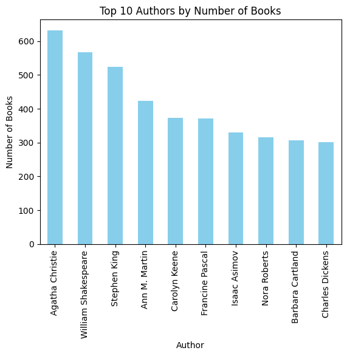 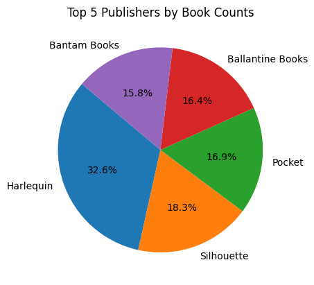 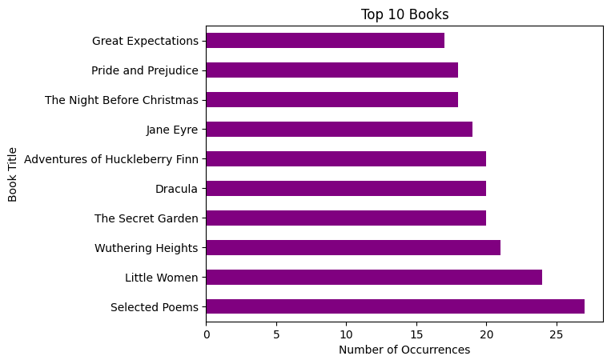 
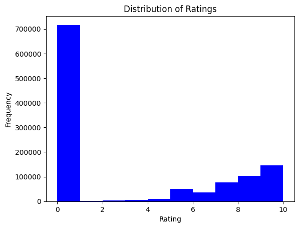 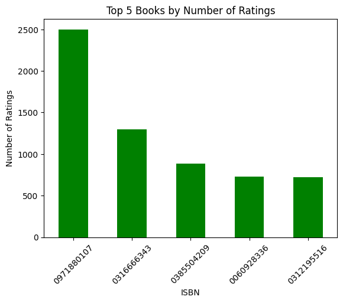 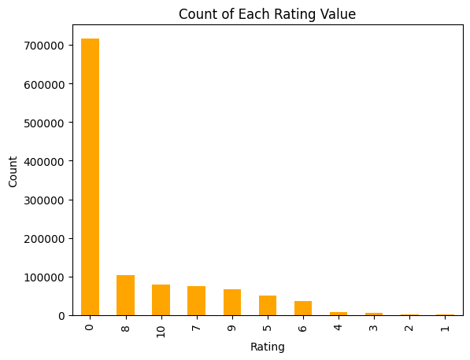 
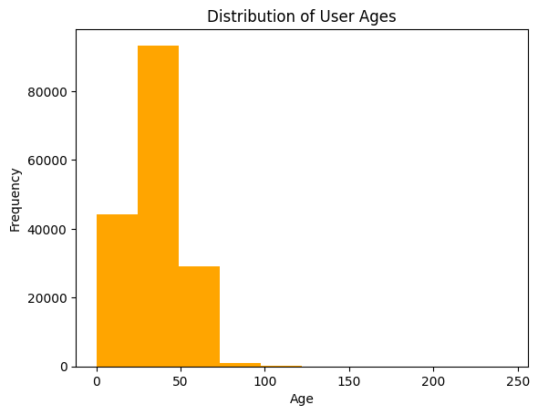 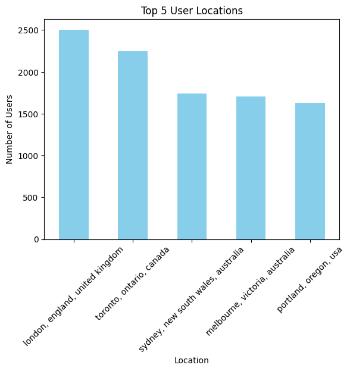 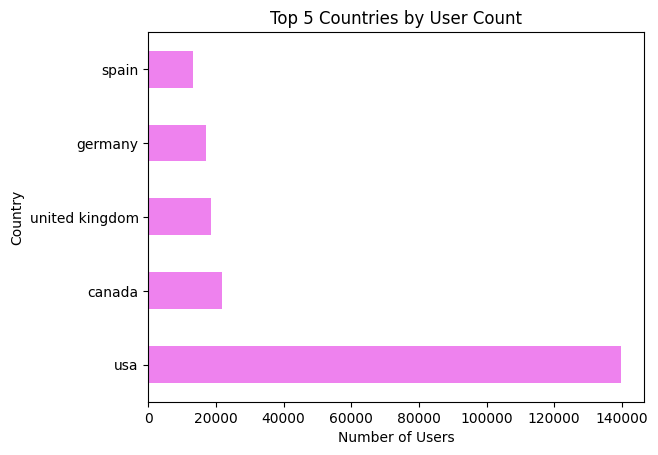

---

## 🧹 5. Data Preprocessing:
The following steps were taken to preprocess the data for modeling:
- **Data Loading:** Load books, users, and ratings data using Pandas.
- **Data Cleaning:** Renamed columns for better readability, handled missing values.
- **Filtering Users:** Focused on users with more than 200 ratings for better quality recommendations.
- **Data Merging:** Merged ratings and books data on the `ISBN` field.
- **Pivot Table Creation:** Created a user-book matrix for collaborative filtering.
- **Sparse Matrix:** Used `csr_matrix` to efficiently handle sparse data.

---

## 🛠️ 6. Methodology

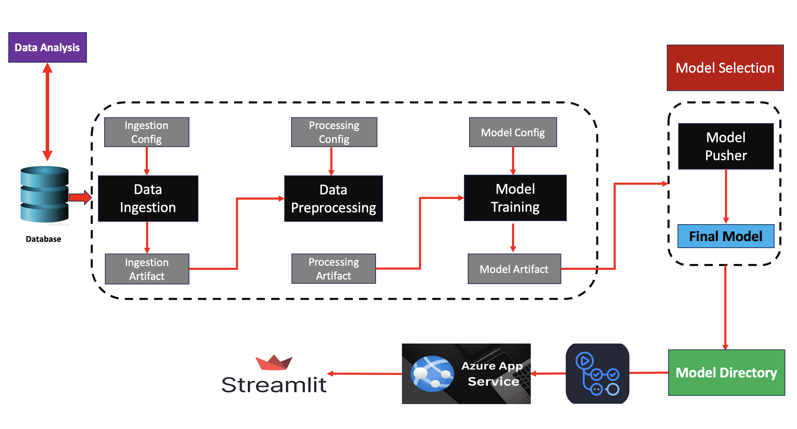 

### Key Steps:
1. **Data Ingestion**: Ingest data and split into training/testing datasets.

2. **Data Preprocessing**: Handle missing values, engineer features.

3. **Model Building**: Compare several models and select the best one based on performance (e.g., K-Nearest Neighbors).

   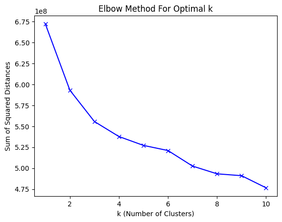
   
5. **Web Application**: Developed using Streamlit for inference.

   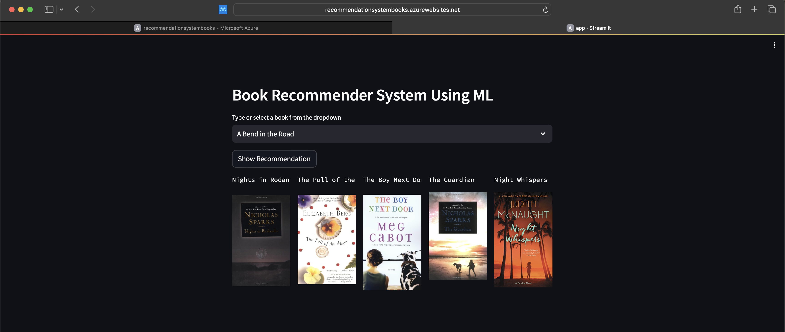
   
6. **CI/CD Pipeline**: Automated using GitHub Actions for continuous integration and deployment.

   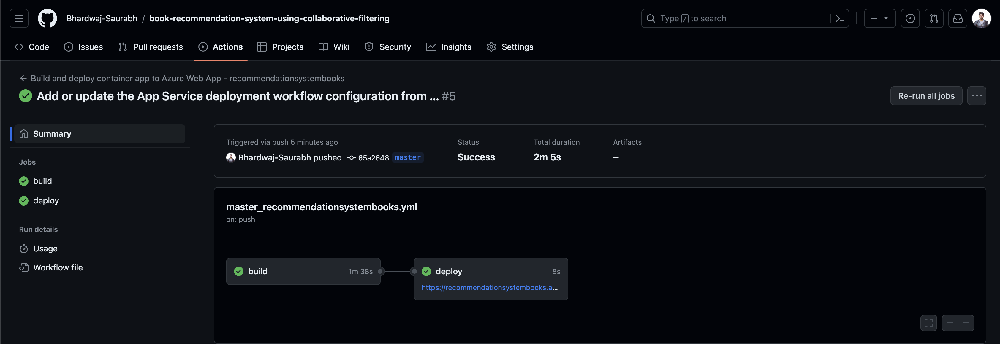
   
8. **Deployment**: Hosted on Azure Web App Services.

   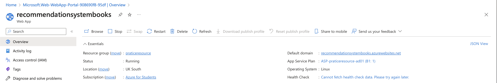

---

## 🚀 7. Usage Instructions

### To run locally, follow these steps:

```bash
git clone https://github.com/Bhardwaj-Saurabh/book-recommendation-system-using-collaborative-filtering.git
cd book-recommendation-system-using-collaborative-filtering
python3 -m venv venv
source venv/bin/activate  # For MacOS
pip install -r requirements.txt
streamlit run app.py
```

**To build using Docker:**

Prerequisites: Ensure Docker is installed.
```
docker pull aryansaurabhbhardwaj/bookrecommendationsystem:new
docker run -p localport:containerport aryansaurabhbhardwaj/bookrecommendationsystem:tagname
```

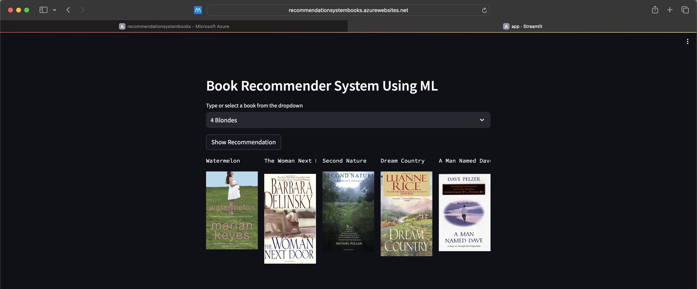

##  🏆 8. Conclusion

This project successfully developed a book recommendation system using collaborative filtering. The primary challenge was handling data sparsity. Advanced techniques like matrix factorization were employed to enhance performance. The system was deployed as a web app using Docker, GitHub Actions, and Azure Web App Services.

**Future Improvements:**

	•	Improved Personalization
	•	Enhanced Data Quality
	•	Explore Neural Networks for Better Recommendations

##  💼 9. License, Author & Acknowledgments

License: MIT License

Author: Saurabh Bhardwaj

Contact: [LinkedIn](https://www.linkedin.com/in/saurabhbhardwajofficial/)

Acknowledgments: Special thanks to Kaggle and ineuron.ai for project guidance.

Data Source: Kaggle Dataset
